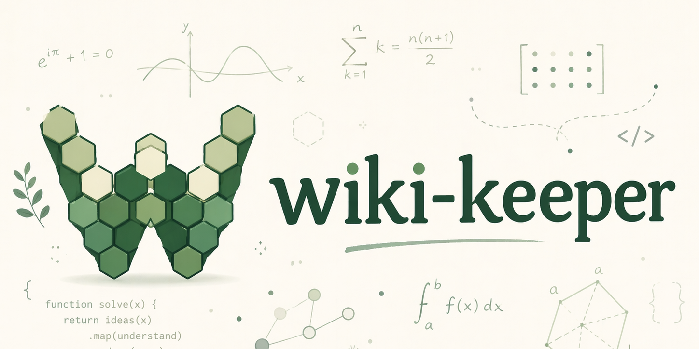
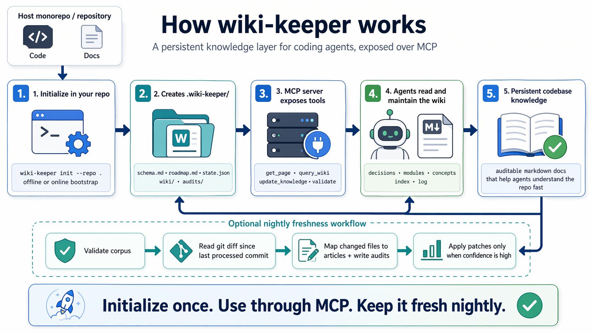

<p align="center">
  
</p>

<p align="center">
  <strong>A persistent repository wiki for coding agents, exposed over MCP.</strong>
</p>

<p align="center">
  <a href="https://github.com/icosahedron10/wiki-keeper/blob/main/LICENSE"></a>
  
  
  
</p>

---

## What wiki-keeper does

Coding agents lose project context between sessions. wiki-keeper gives them a
durable markdown wiki that lives inside the repository at `.wiki-keeper/`.
Agents can read, search, update, validate, and review that wiki through MCP
tools or through the `wiki-keeper` CLI.

The project has three main surfaces:

- **A repo-local wiki corpus** under `.wiki-keeper/`, with pages, schema,
  roadmap, state, mutation log, and audit notes.
- **A Python MCP server and CLI** in `mcp_server/`.
- **An optional static Next.js site scaffold** copied from
  `mcp_server/site_template/`.

## How it works

<p align="center">
  
</p>

The deterministic tools read and write only the wiki corpus. The model-assisted
flows use OpenAI for initialization and git-delta review, then apply patches
only through the same atomic wiki write path.

## Quickstart

Install the package in editable mode:

```sh
python -m pip install -e .
```

Initialize or refresh the wiki corpus:

```sh
OPENAI_API_KEY=... wiki-keeper init --repo .
```

Run the MCP server:

```sh
wiki-keeper mcp
```

When the package is not located inside the host repository, set
`WIKI_KEEPER_ROOT` for MCP clients:

```sh
WIKI_KEEPER_ROOT=/path/to/host/repo wiki-keeper mcp
```

## CLI

```sh
wiki-keeper mcp
wiki-keeper init --repo . [--dry-run] [--refresh-bootstrap] [--since <sha>]
wiki-keeper validate --repo .
wiki-keeper run-nightly --repo . [--since <sha>] [--until <sha>] [--dry-run] [--json-output <path>]
wiki-keeper site init --repo . --site-dir site [--dry-run] [--force]

wiki-keeper tools --repo . get "concepts/Repository Overview"
wiki-keeper tools --repo . list [--category concepts|modules|decisions]
wiki-keeper tools --repo . query "authentication" [--top-k 5]
wiki-keeper tools --repo . update "concepts/Foo" --mode replace --content "..."
wiki-keeper tools --repo . rebuild-index
wiki-keeper tools --repo . lint
```

`init`, `run-nightly`, and MCP `run_nightly` require `OPENAI_API_KEY` when they
need to call a model. Deterministic read/write/search/lint tools do not.

## MCP tools

| Tool | Purpose |
|---|---|
| `get_page` | Read a page by title or `category/Title`. |
| `read_article` | Read a page with parsed frontmatter and latest audit metadata. |
| `read_audits` | Read recent audit notes for an article id. |
| `list_pages` | List pages, optionally filtered by category. |
| `list_articles` | List pages with frontmatter and last-audit metadata. |
| `next_review` | Return the next roadmap entry after the state cursor. |
| `run_review` | Run the git-delta nightly review workflow across all matched diffs. |
| `run_nightly` | Run the git-delta freshness workflow. |
| `query_wiki` | Keyword search across wiki pages. `hybrid` mode is accepted by the schema but semantic search is not implemented yet. |
| `update_knowledge` | Create, replace, or append a page atomically, then rebuild the index and append the wiki log. |
| `rebuild_index` | Regenerate `.wiki-keeper/wiki/index.md`. |
| `lint_wiki` | Check links, index drift, orphans, and mutation log format. |
| `validate` | Run layout, state, roadmap, frontmatter, source-glob, schema, and lint checks. |

## Corpus layout

```text
.wiki-keeper/
├── schema.md        # canonical page schema
├── roadmap.md       # review order, one page id per line or bullet
├── state.json       # roadmap cursor, git baseline, run history, init metadata
├── wiki/
│   ├── index.md     # generated page index
│   ├── log.md       # append-only mutation log
│   ├── decisions/
│   ├── modules/
│   └── concepts/
├── sources/         # reserved source-note buckets
└── audits/          # YYYY-MM-DD/*.md review and initialization notes
```

Pages must use the sections defined in `.wiki-keeper/schema.md`. Module pages
may include YAML frontmatter with `id`, `title`, and `sources`; nightly review
uses `sources` globs to map changed repository paths back to wiki articles.

## Nightly review

`run-nightly` is commit-driven:

1. Validate the corpus, allowing source globs that currently match no files.
2. Resolve a git range from `--since`, `--until`, or
   `.wiki-keeper/state.json`.
3. Collect changed paths with `git diff --name-only`.
4. Match changed paths to article frontmatter `sources`.
5. If nothing maps, write an audit-only note and advance git state.
6. If articles map, send all pending matches to one strict JSON-schema model
   call.
7. Accept only `patch` or `audit_only` decisions with `high`, `medium`, or
   `low` confidence.
8. Apply a patch only when confidence is `high` and the replacement body passes
   schema checks.
9. Write audit notes, append the wiki log, and update git run state.

The default nightly model is `gpt-5.4-nano`, overridden by
`WIKI_KEEPER_NIGHTLY_MODEL`.

The default initialization model is `gpt-5.4-mini`, overridden by
`WIKI_KEEPER_INIT_MODEL`.

## Static site

```sh
wiki-keeper site init --repo . --site-dir site
```

This copies the read-only Next.js site template into `site/`, writes
`site/lib/generated-config.ts`, and creates `vercel.json` when one does not
already exist. If `vercel.json` already exists, the command reports the required
Vercel settings instead of merging them automatically.

## CI and release checks

Local checks used by the project:

```sh
python -m pip install -e ".[dev]"
python -m ruff check .
python -m mypy mcp_server --exclude "mcp_server/tests"
python -m pytest
python -m build
```

The repository includes a composite nightly action at
`.github/actions/wiki-keeper-nightly/action.yml` and a host workflow template at
`docs/workflows/wiki-keeper-nightly.yml`.

## License

MIT - see [LICENSE](LICENSE).
